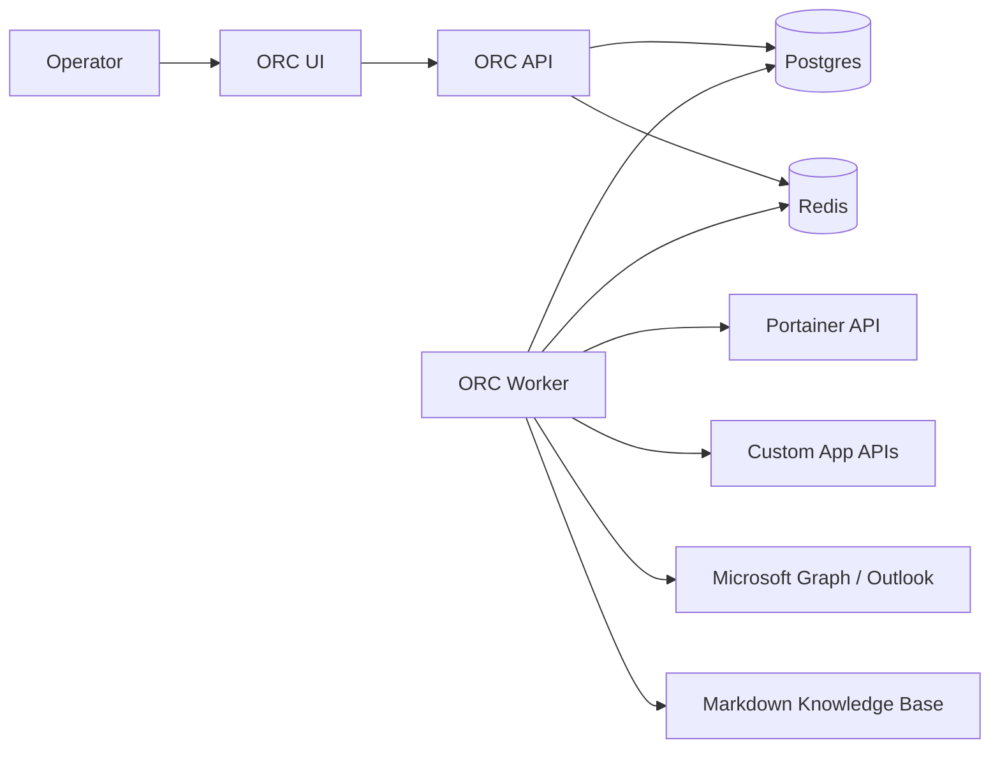
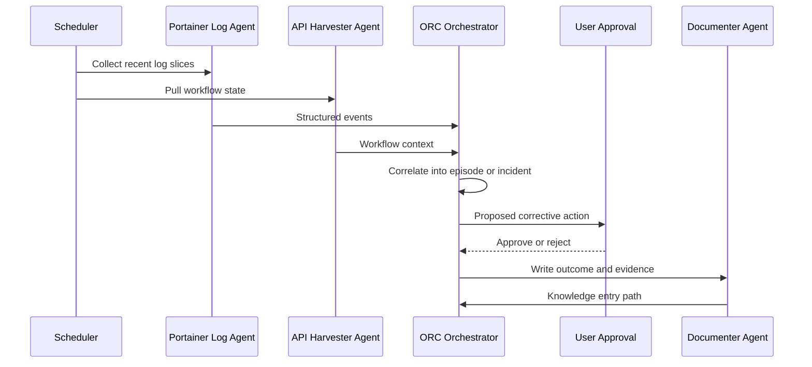

# ORC Architecture Recommendation

## Recommendation

Build ORC as a modular service-oriented stack with a Python orchestration core.

### Why This Stack

- Python is the fastest path for Portainer integration, API connectors, background jobs, LLM workflows, and Markdown processing.
- FastAPI provides a clean API surface for a future web client and external tools.
- Postgres gives durable relational state for incidents, approvals, and execution history.
- Redis supports lightweight queues, scheduling, and transient agent messages.
- Markdown-based specs keep agent and skill logic reviewable by humans and coding assistants.

## Logical Components

1. API service
2. Worker service
3. Registry loader for Markdown agent and skill definitions
4. Portainer adapter
5. Custom API adapter framework
6. Approval service
7. Knowledge writer
8. Notification service for Outlook
9. UI service in a later phase

## Deployment Shape

## Containerization Pattern

Run ORC as a Portainer stack with these containers:

- `orc-api`
- `orc-worker`
- `orc-postgres`
- `orc-redis`
- `orc-ui` in phase 2

### Runtime Notes

- Mount a configuration volume for agent and skill definitions if they need live updates.
- Mount secrets through Portainer secrets or environment file references.
- Limit outbound access to approved endpoints only.

## Agent Model

An agent is a policy-bearing actor with:

- identity
- scope
- trigger rules
- allowed skills
- approval boundary
- output contract

A skill is a reusable capability with:

- purpose
- inputs
- outputs
- integration dependencies
- risk level
- audit requirements

## Orchestration Flow

## Integration Standards

### Portainer

- Use Portainer API tokens supplied at runtime
- Prefer pull-based collection to start
- Scope initial support to configured endpoints and stacks

### Custom APIs

- Standard connector interface: auth, fetch, normalize, checkpoint
- Keep connector code isolated from orchestration logic

### Outlook

- Use Microsoft Graph for email and approval routing
- Model outbound messages as notifications, not free-form agent actions

## Data Handling

- Store raw evidence references and normalized event summaries
- Preserve original timestamps and source identifiers
- Maintain explicit links from incidents to approvals and remediation actions

## Security Model

1. Secrets never stored in Git.
2. Remediation requires explicit approval in phase 1.
3. Agent permissions are allow-list based.
4. Each action produces an audit record.
5. External connectors are isolated and retry-bound.

## UI Recommendation

Do not begin with a game-first interface. Build:

1. an operator dashboard
2. a workflow timeline
3. an approval inbox
4. an agent registry viewer

Then add a stylized “mystical orc command table” presentation where agents appear as visual characters moving messages across the workflow map.